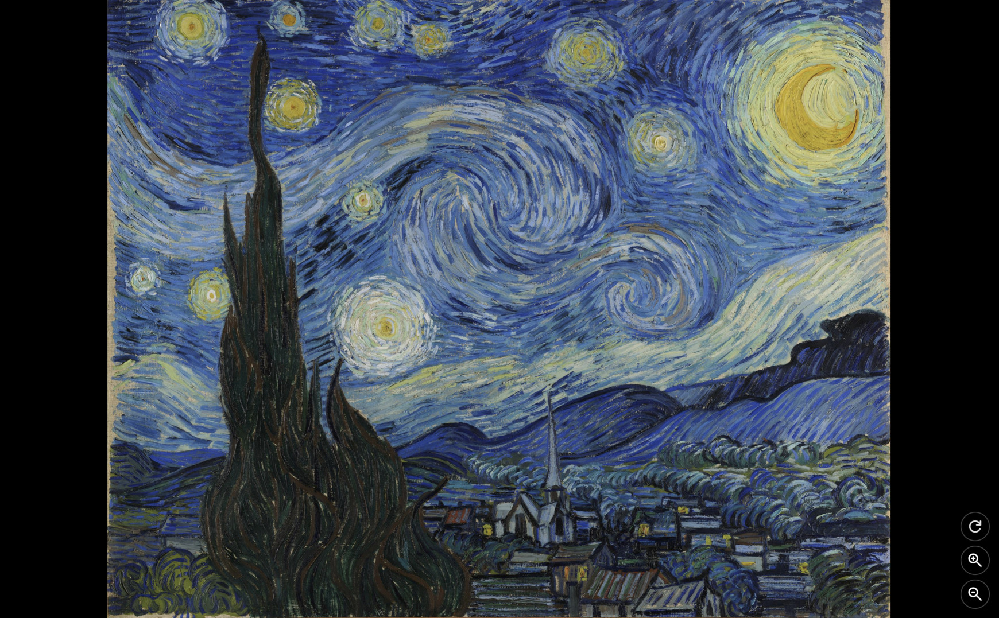
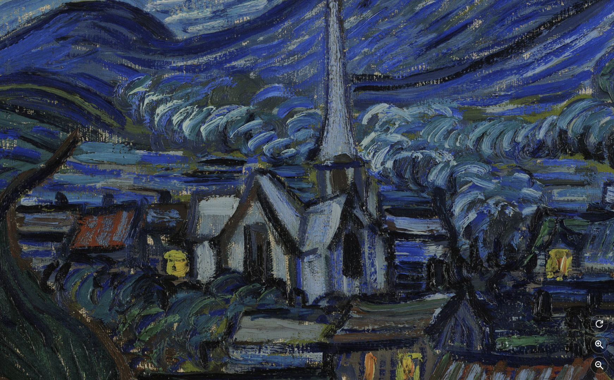

# Deepzoom Image Creator & Viewer





Setup:

```
pip install -r requirements.txt
```

Create deepzoom image:

```
python create.py path/to/image path/to/destination
```

View deepzoom image:

```
python deepzoom.py path/to/deepzoom
```
